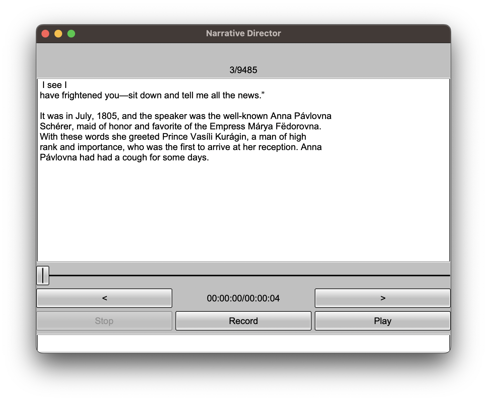

# Narrative Director (Rust Edition)

## Summary
Narrative Director is an alternative Audio/Video Recording application tailored for working on medium to large-sized projects.
This tool aspires to keep editing to a minimum with the capability of playing, recording and re-recording readings in place at
the paragraph level for some text piece, whether it's a script, or a novel.

The Rust Edition serves as a successor to the [Qt 5 edition of Narrative Director](https://github.com/divark/narrative-director), in
addition to having an excuse to learn about [Rust](https://www.rust-lang.org/) and [Relm](https://github.com/antoyo/relm).

## Features
### Current
- Read paragraph-by-paragraph (4 sentences) from UTF-8 text files.
- Jump to particular paragraph entry.
- Play, Pause, Stop, and Record Audio for each paragraph entry.
### Planned
- Play, Stop, and Record Video for each paragraph entry.

## User Interface Preview
##### Main Application

##### Settings

## Known Working Environments
- M1 Mac Mini
- Linux x64 (Arch Linux)
## Getting Started
1. Download [Rust](https://www.rust-lang.org/learn/get-started) if you have not already.
2. Download [GTK+3](https://www.gtk.org/docs/installations/).
3. Clone the repository.
4. In a terminal, navigate to the repository.
5. Run `cargo test -- --test-threads=1` to ensure all features are working as intended.
6. Run `cargo run` to see the current state of the application.

## License
Narrative Director's code is distributed under the GPLv3 License, which can be viewed [here.](COPYING)
